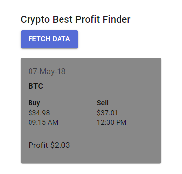

## Crypto Data UI and API Server

Frontend was bootstrapped with [Create React App](https://github.com/facebook/create-react-app).

Backend is contained in `server` folder and is Node-Express based. It also contains Swagger UI for  
refering API documentation.

## Available Scripts

In the project directory, you can run:

### `yarn start`

Runs the app in the development mode. 
Open [http://localhost:3000](http://localhost:3000) to view it in the browser.

The page will reload if you make edits. 
You will also see any lint errors in the console.

### `yarn test`

Launches the test runner in the interactive watch mode. 
See the section about [running tests](https://facebook.github.io/create-react-app/docs/running-tests) for more information.

### `yarn test:coverage`

Launches the test runner without watch mode and reports coverage percentage. 
Currently, the thresholds are set to 90%.

### `yarn build`

Builds the app for production to the `build` folder. 
It correctly bundles React in production mode and optimizes the build for the best performance.

The build is minified and the filenames include the hashes. 
Your app is ready to be deployed!

See the section about [deployment](https://facebook.github.io/create-react-app/docs/deployment) for more information.

### `yarn server`

Launches the API server on port number 3030. Open [API](http://localhost:3030/data/best) to fetch  
to fetch best profit details for each day, each currency.

Also, open[API-Docs](http://localhost:3030/api-docs) to view and try-out APIs using Swagger UI.

